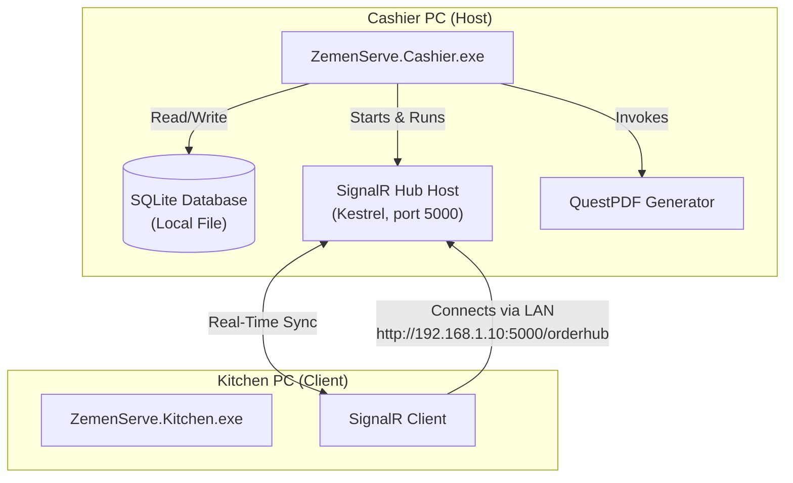
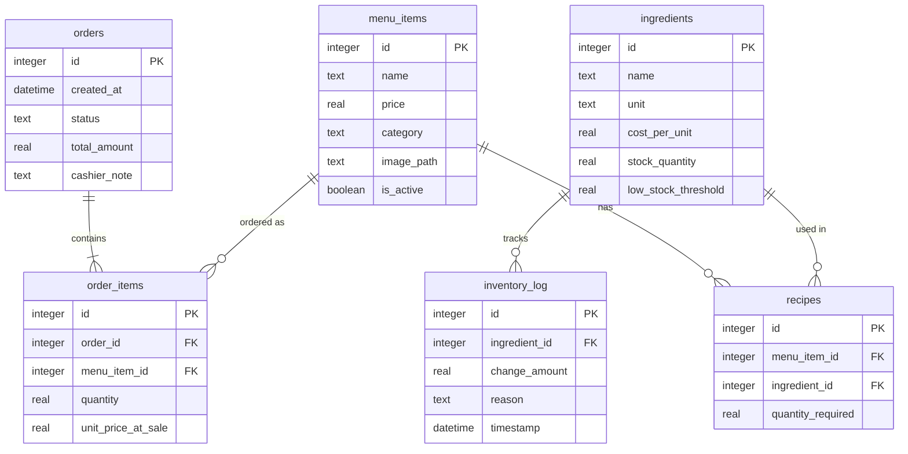

# ZemenServe — Technical Build Specification

## 1. Project Overview
- **Product Name**: ZemenServe
- **Publisher**: Zemen Tech
- **Target Market**: Hotels and restaurants in Ethiopia
- **Category**: Offline point-of-sale (POS) and food & beverage (F&B) control system
- **Platform**: Native Windows desktop system, operating strictly over a local area network (LAN) with zero internet dependency.

ZemenServe is a dual-application desktop system designed to streamline order flows from cashiers to kitchens in real time, track F&B inventory at the ingredient level, and generate daily performance reports for management.

---

## 2. Non-Negotiable Constraints
- **No Internet Dependency**: All operations must execute locally. The system runs entirely over a local wired LAN (e.g., a direct Ethernet connection or local switch) without requiring external DNS or WAN routing.
- **No Manually-run Servers**: The system must not require command-line setup or separate database/web servers started by users. Double-clicking the cashier or kitchen executables starts all underlying host processes (including the SQLite database engine and the SignalR hub server).
- **Architecture & Performance**: Fast, near-instantaneous (under 1 second target) communication between the Cashier and Kitchen interfaces on a standard LAN.
- **Zero Software Cost**: Open-source, free-for-commercial-use libraries and tools only (.NET 8, WPF, SQLite, EF Core, ASP.NET Core SignalR, and QuestPDF Community License).
- **Native Experience**: Native Windows desktop WPF applications rather than electron, web, or browser-based solutions.

---

## 3. System Architecture & Network Setup

### Cashier App (Host)
- **UI Responsibility**: Order entry, cart management, checkout, digital menu catalog, inventory configuration/view, and manager report generation screen.
- **Storage**: Manages the local SQLite database file directly.
- **Server Hub**: Embeds and hosts a lightweight ASP.NET Core Kestrel instance running a SignalR hub on startup.
- **Reporting**: Generates the local daily manager PDF using QuestPDF.

### Kitchen App (Client)
- **UI Responsibility**: Thin real-time display showing the active order queue with action buttons to update status.
- **Storage**: Has no local database; acts strictly as a real-time terminal.
- **Client Sync**: Connects to the Cashier PC's self-hosted SignalR Hub automatically on startup.
- **Network Resolution**: Cashier PC is assigned a static IP (e.g., `192.168.1.10`). The Kitchen app resolves this IP via a local settings file (`settings.json`).

---

## 4. Core Features

### 4.1. Ordering & Order Tracking
- **Flow**: Waiter takes the customer's order verbally -> Cashier inputs the items into the Cashier app -> Order is immediately sent to the Kitchen -> Chef prepares and marks order states -> Cashier receives real-time updates when orders are ready.
- **Order Status Transition**:
  $$\text{Pending} \longrightarrow \text{Preparing} \longrightarrow \text{Ready} \longrightarrow \text{Served}$$
- **Speed**: Transmission delay for new orders and status updates must remain under 1 second on a standard LAN interface.

### 4.2. Inventory & F&B Control
- **Recipe Definition**: Each menu item is mapped to a recipe containing a list of raw ingredients and their specific metric quantities (e.g., *Beef Burger = 200g beef + 1 bun + 30g cheese + 50ml sauce*).
- **Deduction Engine**: Placing an order automatically deducts the ingredient quantities from the database in the *same database transaction* as the order creation.
- **Low-Stock Warnings**: Flags any ingredient whose current stock level drops below a user-defined threshold.
- **Cost Allocation**: Cost per dish is calculated dynamically based on its ingredients' unit costs.

### 4.3. Digital Menu (Standalone Module)
- **Design Philosophy**: An independent, decoupled database table and user interface screen.
- **Function**: Displays food items with their metadata (name, price, category, image path, active status).
- **Decoupling**: Can be swapped or modified later without altering the primary billing/ordering state machine.

### 4.4. Daily Report
- **Delivery**: Generates a PDF report at the close of operations, saved locally to the Cashier's disk.
- **KPI Metrics**:
  - Total Revenue for the day.
  - Total Cost of Goods Sold (COGS) based on recipe ingredient costs consumed.
  - Net Profit ($\text{Revenue} - \text{COGS}$).
  - Detailed breakdown of sales by item.

---

## 5. Database Schema (SQLite)

The database resides solely on the Cashier PC.

### Table Structure Details

1. **`menu_items`**
   - `id` (INTEGER, Primary Key)
   - `name` (TEXT)
   - `price` (REAL)
   - `category` (TEXT)
   - `image_path` (TEXT, Nullable)
   - `is_active` (INTEGER/BOOLEAN)

2. **`ingredients`**
   - `id` (INTEGER, Primary Key)
   - `name` (TEXT)
   - `unit` (TEXT - e.g., 'g', 'ml', 'pcs')
   - `cost_per_unit` (REAL)
   - `stock_quantity` (REAL)
   - `low_stock_threshold` (REAL)

3. **`recipes`**
   - `id` (INTEGER, Primary Key)
   - `menu_item_id` (INTEGER, Foreign Key referencing `menu_items.id`)
   - `ingredient_id` (INTEGER, Foreign Key referencing `ingredients.id`)
   - `quantity_required` (REAL)

4. **`orders`**
   - `id` (INTEGER, Primary Key)
   - `created_at` (TEXT/DATETIME)
   - `status` (TEXT - 'Pending', 'Preparing', 'Ready', 'Served')
   - `total_amount` (REAL)
   - `cashier_note` (TEXT, Nullable)

5. **`order_items`**
   - `id` (INTEGER, Primary Key)
   - `order_id` (INTEGER, Foreign Key referencing `orders.id`)
   - `menu_item_id` (INTEGER, Foreign Key referencing `menu_items.id`)
   - `quantity` (REAL)
   - `unit_price_at_sale` (REAL - captured at transaction time)

6. **`inventory_log`**
   - `id` (INTEGER, Primary Key)
   - `ingredient_id` (INTEGER, Foreign Key referencing `ingredients.id`)
   - `change_amount` (REAL - negative for deductions, positive for restocks)
   - `reason` (TEXT - e.g., 'Order #102 Sale', 'Restock', 'Waste')
   - `timestamp` (TEXT/DATETIME)

---

## 6. Real-Time Communication Contract

Hosted on the Cashier PC at `http://<cashier-ip>:5000/orderhub`.

| Event Name | Direction | Payload Schema | Description |
| :--- | :--- | :--- | :--- |
| **`NewOrder`** | Cashier $\rightarrow$ Kitchen | `OrderDto` (id, cashierNote, timestamp, items: [id, name, quantity]) | Sent immediately when an order is finalized at checkout. |
| **`OrderStatusChanged`** | Kitchen $\rightarrow$ Cashier | `OrderStatusChangeDto` (orderId, newStatus) | Sent when the chef changes an order state (e.g., to 'Preparing', 'Ready', or 'Served'). |
| **`ConnectionRestored`** | Kitchen $\rightarrow$ Cashier | *None* | Automatically triggered by the Kitchen client upon reconnecting to synchronize outstanding states. |

---

## 7. Implementation Plan

The project development is broken down into the following 9 phases:

1. **Solution & Schema**: Initialize WPF and Class Library workspace structure. Define Entity Framework Core models and create initial SQLite migrations.
2. **Cashier UI**: Build order entry pages, cart management components, and SQLite transactional submit controls.
3. **SignalR Host**: Embed ASP.NET Core Kestrel in the Cashier application to auto-host the SignalR hub on startup.
4. **Kitchen App**: Build the client WPF project, implement the connection configuration settings file, and render the live order queue screen.
5. **Inventory Logic**: Add automatic recipe deductions and low-stock triggers within the order checkout transaction block.
6. **Digital Menu Module**: Create the standalone display/configuration interface for the food menu.
7. **PDF Report**: Code the daily report template (COGS, gross margins, and item sales) using QuestPDF.
8. **LAN Testing**: Run dual-instance scenarios simulating network disconnects and verifying performance target limits (< 1 second).
9. **Packaging**: Configure self-contained, single-file compilation setups using `dotnet publish`.
